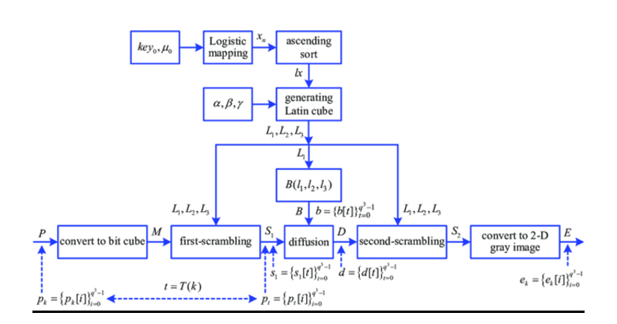
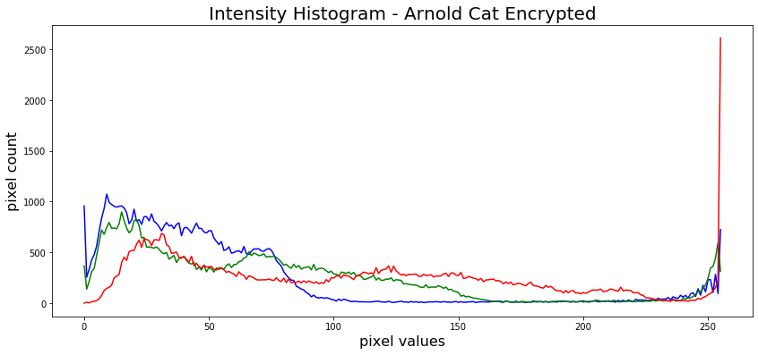
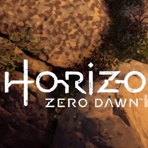
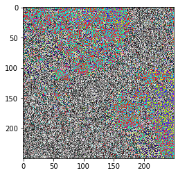

# Image Encryption using Chaos Maps
This is a project in cryptography that involves implementing image encryption using various chaos maps and comparing their merits based on key sensitivity, adjacent pixel autocorrelation and intensity histograms. The chaos maps implemented were - Arnold cat maps, Henon maps, Logistic maps and Duffing chaos maps .
 

<b> What are chaos maps? </b>
 
Chaotic systems are a simple sub-type of nonlinear dynamical systems. They contain a few interacting parts which follow simple rules, but these systems are characterized by a very sensitive dependence on their **initial conditions**. Despite their deterministic simplicity, over time these systems can display and divergent behavior.

 

**Why Chaos Maps for encryption?**
 
Traditional encrypting mechanisms AES and RSA exhibit some drawbacks
and weakness when it comes to encryption of digital images 
  and high computing

*   Large computational time for large images
*   High computing power for large images
Consequently, there might be better techniques for image encryption.

 

A few chaos based algorithms provide a good combination of speed, high security complexity, low computational overheads 
Moreover, **certain** chaos-based and other dynamical systems based algorithms have many important properties such as 

*   sensitive dependence on initial parameters
*   pseudorandom properties
*   ergodicity
*   non periodicity
<h2>System Architecture</h2>

This is the black box diagram of our project and as we can see that the input is an image along with a user defined key. This key is what decides how many times the algorithm must be run which must be kept secret by the user as it can be used later to decrypt. The output of this black box is an encrypted image.

<h2> Chaos Maps </h2>
<h3> Arnold Cat </h3>

Arnold's cat map is a chaotic map from the torus into itself. It is named after Vladimir Arnold, who demonstrated its effects using a cat image in the 1960s, hence the name
Few important properties of arnold map include: 
●	It is invertible due to the fact that the matrix has a determinant of 1 and its inverse has integer entries. 
●	It is area preserving 
●	It is ergodic and mixing 
●	It is an Anosov diffeomorphism and in particular it is structurally stable. 

<h3> Henon Map </h3>

Henon map may be stated as a two-dimensional iterated discrete-time dynamical system with a chaotic attractor as proposed by Henon in 1976.Henon map is employed for generating random values, which is used in diffusion process. To guarantee the security of this new method various statistical analysis are carried out. The results show that the proposed method ensures the highest security level in terms of NPCR, UACI and entropy of the cipher image

<h3> Logistic Map</h3>

The logistic map is a polynomial mapping (or, equivalently, a recurrence relation) of degree 2. It is frequently cited as a prototypical illustration of how complex, chaotic behavior can result from extremely basic nonlinear dynamical equations. The objective of this nonlinear difference equation is to represent two effects: 
●	reproduction, in which the population grows at a rate proportional to its present size when the population is small. 
●	Starvation (density-dependent mortality), in which the growth rate will decrease at a rate proportional to the value obtained by subtracting the present population from the theoretical "carrying capacity" of the environment.

<h3> Duffing Map </h3>

The Duffing map (also called 'Holmes map') is a discrete-time dynamical system. It is an example of a dynamical system that exhibits chaotic behavior.The map depends on the two constants a and b. These are usually set to a = 2.75 and b = 0.2 to produce chaotic behaviour. It is a discrete version of the Duffing equation

## Images
### Original Image

### Encrypted Images

#### Image after Arnold Cat Encryption

#### Image after Henon Map Encryption

#### Image after Logistic Map Encryption

## Visualisation

### Arnold Encryption

 
### Henon Encryption

 
### Duffing Encryption

## Intensity Histogram

The ciphertext image histogram analysis is one of the most straight-forward methods ofillustrating the image encryption quality. A good image encryption method tends to encrypt a plaintext image to a random incomprehensible form. Thus a good image encyption technique generates a cipher image that has a uniformly distributed intensity histogram.

## Adjacent Pixel Autocorrelation

Since images exhibit high information redundancy, it is desirable to have an encryption algorithm that breaks this redundancy. Thus as a metric of encryption performance we find the correlation between adjacent pixels in a direction (Horizontal, Vertical or Diagonal). We have considered the Horizontal direction. 

1024 random pixels are picked up from the image and its correlation between it's rightmost neighbour is found and plotted. For a good algorithm, the correlation plot should appear random with no discernable pattern.

 

## Key Sensitivity
An ideal image encryption algorithm should be sensitive with respect to thesecret key i.e a small change in the key should produce a completely differentencrypted image.To test the key sensitivity the we encrypt the plain image with the threealgorithms. We then try decrypting them with a slightly changed key.
### Arnold Cat
#### Original Image

#### Encrypted with key = 20

#### Decrypted with key = 19

### Henon Map
#### Original Image

#### Encrypted with key = (0.1, 0.1)

#### Decrypted with key = (0.1, 0.101)

### Logistic Map
#### Original Image

#### Encrypted with key = "supersecretke"

#### Decrypted with key = "supersecretkd"

